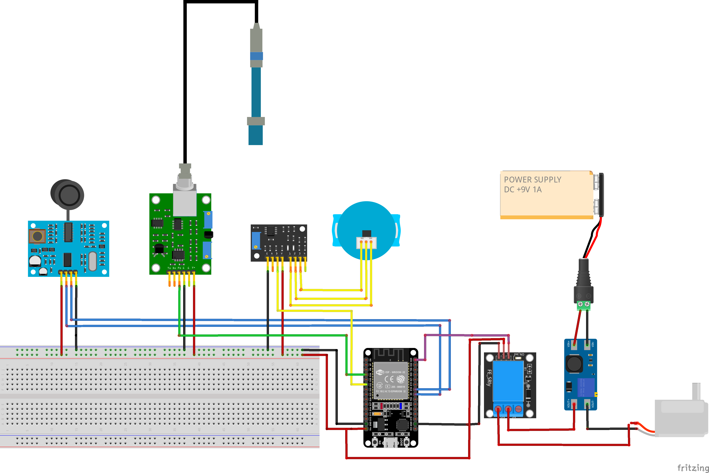

# Smart IoT Water Trough with Water Quality Monitoring for Rural Areas

An ESP32-based IoT system for automatically refilling a water trough and monitoring water quality (water level, pH, and turbidity), with sensor readings sent to an Adafruit IO web dashboard.

**Author:** Matheus Viganó Schirrmann
**Course:** Projeto Integrador 1 — DEC0013
**Semester:** 2026.1

---

## Introduction

It is common for small and medium-sized farms to supply drinking water for animals from wells, ponds, or other natural water sources. These sources may contain microorganisms, waste, bacteria, mud, or sediment that can contaminate the water offered to livestock. This project aims to simplify water quality monitoring by measuring key parameters, reducing the risk of disease, death, and poor animal development. In addition, the system automatically refills the water trough whenever a low water level is detected.

---

## Project Description

The ultrasonic sensor measures the water level inside the trough. Whenever the water level becomes too low, the system activates the water pump until the sensor detects that the desired level has been reached. Once the trough has been refilled, pH and turbidity measurements are performed to verify the quality of the supplied water.

Water level, pH, and turbidity readings are transmitted via MQTT to an Adafruit IO web dashboard, allowing remote monitoring and easier data visualization.

---

## Objectives

1. Monitor the water level inside the trough using the JSN-SR04T ultrasonic sensor.
2. Automatically activate the water pump (through a relay) whenever the water level becomes too low.
3. Monitor water quality by measuring pH and turbidity.
4. Send all sensor readings to an online dashboard (Adafruit IO) for remote monitoring.

---

## Technologies Used

**Hardware:** ESP32 · JSN-SR04T ultrasonic sensor · 4502C pH sensor · turbidity sensor · relay module + water pump · MT3608 step-up module · 9 V power supply

**Software:** PlatformIO + Visual Studio Code · Arduino Framework (espressif32) · Adafruit IO (dashboard) · Git/GitHub

---

## Repository Structure

```text
.
├── platformio.ini        → PlatformIO project configuration
├── src/                  → ESP32 firmware source code
│   ├── main.cpp          → Main application
│   ├── Sensores/         → Individual sensor/actuator source code
│   └── test/             → Standalone tests
├── README.md             → Portuguese documentation
├── README_EN.md          → English documentation
└── docs/                 → Project documentation
    ├── 01_Planejamento.md
    ├── 02_Lista_de_Materiais.md
    ├── 03_Lista_de_Pinagem.md
    ├── 04_Softwares_e_Versoes.md
    ├── Diagramas/                → Electrical and communication diagrams
    ├── Hardware/
    │   ├── Sensores/             → Individual sensor documentation
    │   └── Imagens/              → Assembly pictures
    └── Software/
        ├── Tutorial_Instalacao.md
        ├── Dashboard/            → Dashboard screenshots
        └── Prototipacao/         → Screens and mockups
```
---

## System Architecture

The figure below illustrates the overall architecture of the system. The ESP32 collects data from the ultrasonic, pH, and turbidity sensors, controls the water pump through a relay, and sends the measurements via Wi-Fi using the MQTT protocol to the Adafruit IO dashboard.

> **Figure:** System architecture.


---

## Components

| Component                   | Function                                  | Signal Type         |
| --------------------------- | ----------------------------------------- | ------------------- |
| ESP32                       | Wi-Fi microcontroller (system controller) | —                   |
| JSN-SR04T Ultrasonic Sensor | Measures the water level                  | Digital (Trig/Echo) |
| 4502C pH Sensor             | Measures water pH                         | Analog              |
| Turbidity Sensor            | Measures water turbidity                  | Analog              |
| Relay Module                | Switches the water pump on and off        | Digital             |
| Water Pump                  | Refills the water trough                  | —                   |
| MT3608 Step-Up Module       | Increases the supply voltage for the pump | —                   |
| 9 V Power Supply            | Powers the system                         | —                   |

---

## Hardware Diagram

The following figure presents the complete hardware assembly of the project, including the ESP32, sensors, relay module, water pump, MT3608 step-up converter, and power supply.

> **Figure:** Hardware diagram.



---


## Navigation

* Project planning and requirements → [`docs/01_Planejamento.md`](docs/01_Planejamento.md)
* Circuit assembly → [`docs/03_Lista_de_Pinagem.md`](docs/03_Lista_de_Pinagem.md) + [`docs/Diagramas/`](docs/Diagramas/)
* Individual sensor documentation → [`docs/Hardware/Sensores/`](docs/Hardware/Sensores/)
* Installation guide → [`docs/Software/Tutorial_Instalacao.md`](docs/Software/Tutorial_Instalacao.md)

---

## Running the Project

**Prerequisite:** Visual Studio Code with the **PlatformIO IDE** extension installed.

```bash
git clone https://github.com/Dryiwnl/iot-water-refill-quality.git
cd iot-water-refill-quality
```

Then, in Visual Studio Code, use the PlatformIO buttons located on the bottom toolbar:

* ✓ (check) → Build the project
* → (arrow) → Upload the firmware to the ESP32
* 🔌 (plug) → Open the Serial Monitor

> **Note:** Wi-Fi and Adafruit IO credentials are stored in `src/secrets.h`, which is **not** included in the repository for security reasons. Create your own file following the instructions provided in the installation guide.
